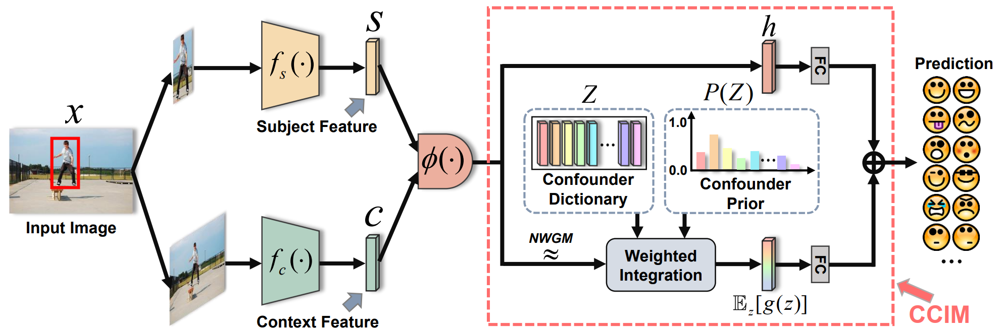

# CCIM
This repository contains the PyTorch implementation of the core contribution *Contextual Causal Intervention Module (CCIM)* from the CVPR2023 paper:

[Context De-confounded Emotion Recognition](https://arxiv.org/pdf/2303.11921.pdf)

## Abstract

Context-Aware Emotion Recognition (CAER) is a crucial and challenging task that aims to perceive the emotional states of
the target person with contextual information. Recent approaches invariably focus on designing sophisticated architectures 
or mechanisms to extract seemingly meaningful representations from subjects and contexts. However, a long-overlooked issue 
is that a context bias in existing datasets leads to a significantly unbalanced distribution of emotional states among different 
context scenarios. Concretely, the harmful bias is a confounder that misleads existing models to learn spurious correlations based 
on conventional likelihood estimation, significantly limiting the models' performance. To tackle the issue, this paper provides a 
causality-based perspective to disentangle the models from the impact of such bias, and formulate the causalities among variables in 
the CAER task via a tailored causal graph. Then, we propose a Contextual Causal Intervention Module (CCIM) based on the backdoor adjustment 
to de-confound the confounder and exploit the true causal effect for model training. CCIM is plug-in and model-agnostic, which improves diverse 
state-of-the-art approaches by considerable margins. Extensive experiments on three benchmark datasets demonstrate the effectiveness of our CCIM 
and the significance of causal insight.



A general pipeline for the context-deconfounded training. The red dotted box shows the core component that achieves the approximation to causal intervention: our **CCIM**. 

## Confounder Dictionary

To build confounder dictionaries from the different datasets required to implement CCIM, you can access [EMOTIC](https://s3.sunai.uoc.edu/emotic/index.html), [CAER-S](https://caer-dataset.github.io/), and [GroupWalk](https://gamma.umd.edu/researchdirections/affectivecomputing/emotionrecognition/emoticon/) to obtain the corresponding training data. Then, the pre-trained backbone on [Places365](https://github.com/CSAILVision/places365) can be used to extract the context feature set.
Ultimately, you can obtain confounder dictionaries of any size by [clustering operations](https://scikit-learn.org/stable/modules/clustering.html).

## Implementation

In CCIM.py, we provide two implementations of  $\lambda_{i}$ : `dot_product_intervention` and `additive_intervention`. By introducing extracted confounder dictionaries $Z$  and prior probabilities $P(z_{i})$, you can freely insert the CCIM before the classifiers of most CAER models to enjoy the gains from the causal weapon.

## Citation

If you find CCIM useful for your research, please cite the following paper:

```
@article{yang2023context,
  title={Context De-confounded Emotion Recognition},
  author={Yang, Dingkang and Chen, Zhaoyu and Wang, Yuzheng and Wang, Shunli and Li, Mingcheng and Liu, Siao and Zhao, Xiao and Huang, Shuai and Dong, Zhiyan and Zhai, Peng and Zhang, Lihua},
  journal={Proceedings of the IEEE/CVF Conference on Computer Vision and Pattern Recognition (CVPR2023)},
  year={2023}
}
```
